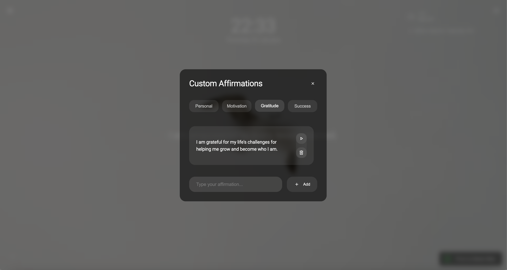
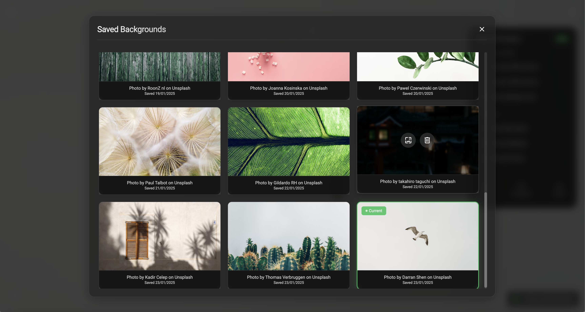
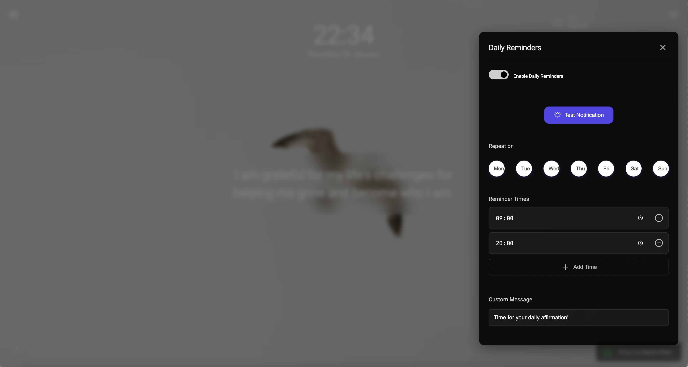
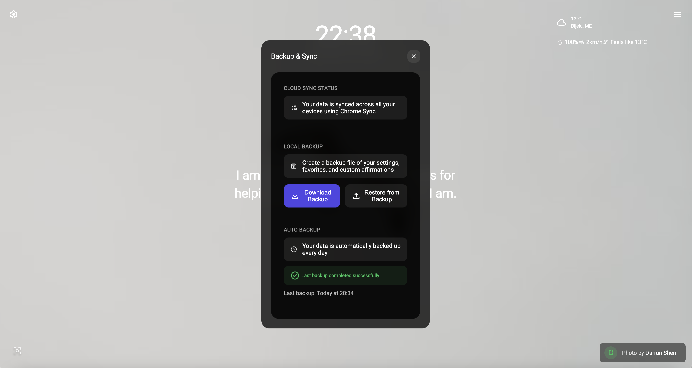
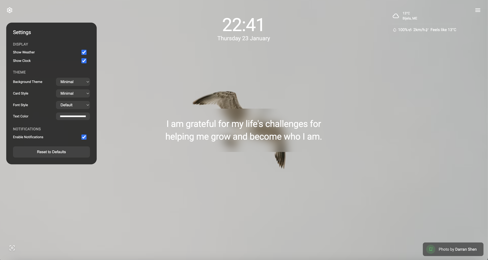

# Daily Affirmations Chrome Extension

Transform your new tab experience with daily affirmations, beautiful backgrounds, and mindfulness features.



## 🌟 Special Early Access

Currently offering **FREE ACCESS** to all premium features during our early access period! Install now to get:
- Custom affirmation library
- Premium background themes
- Cloud sync & backup
- Smart daily reminders
- Advanced focus mode
- And more!

## ✨ Key Features

### Basic Features (Free)
- 🎯 Daily curated affirmations
- 🖼️ Basic nature backgrounds
- ⏰ Weather & clock widgets
- 🎯 Basic focus mode
- 💾 Local storage


### Premium Features (Currently Free)
- 📝 Custom affirmations library
- 🎨 Premium background themes
- ☁️ Cloud sync & backup
- 🔔 Smart daily reminders
- 🎯 Advanced focus mode
- 🎉 Early access to new features
- 💬 Priority support


## 🎨 Feature Highlights

| Feature | Description |
|---------|-------------|
| Custom Backgrounds |  Choose from our premium collection or upload your own |
| Daily Reminders |  Never miss your daily affirmation practice |
| Cloud Backup |  Your data is always safe and synced |
| Theme Customization |  Personalize your experience |

## 🚀 Getting Started

### Installation

1. **For Users:**
   - Visit our [Chrome Web Store page](https://chrome.google.com/webstore)
   - Click "Add to Chrome"
   - Open a new tab to start your mindfulness journey

2. **For Developers:**

```bash
# Clone the repository
git clone https://github.com/yourusername/daily-affirmations.git

# Install dependencies
npm install

# Run development server
npm run dev
# or
yarn dev
# or
pnpm dev
```

Visit [http://localhost:3000](http://localhost:3000) to see the landing page.

### Environment Setup

Create a `.env.local` file in the root directory:

```env
RESEND_API_KEY=your_resend_api_key_here
# Additional environment variables will be added for payment integration
```

## 🛠️ Tech Stack

- **Frontend:** Next.js 14, React, TypeScript
- **Styling:** Tailwind CSS
- **Email Service:** Resend
- **State Management:** Custom state manager
- **Chrome Extension:** Vanilla JavaScript

## 📦 Project Structure

```
├── app/                  # Next.js application
│   ├── components/       # React components
│   ├── api/             # API routes
│   └── pages/           # Page components
├── chrome-extension/     # Extension source
│   ├── js/              # JavaScript modules
│   ├── css/             # Styles
│   └── manifest.json    # Extension manifest
└── public/              # Static assets
```

## 🔄 Development Workflow

1. Make changes to the codebase
2. Run tests: `npm test`
3. Build extension: `npm run build:extension`
4. Load unpacked extension in Chrome for testing

## 🤝 Contributing

We welcome contributions! Please see our [Contributing Guidelines](CONTRIBUTING.md) for details.

## 📝 License

This project is licensed under the MIT License - see the [LICENSE](LICENSE) file for details.

## 🔮 Roadmap

- [ ] Integration with LemonSqueezy for payments
- [ ] Mobile companion app
- [ ] Social sharing features
- [ ] Advanced analytics dashboard
- [ ] AI-powered affirmation suggestions

## 📞 Support

Need help? Contact us at support@daily-affirmation.today

---

Built with ❤️ for mindfulness and productivity
